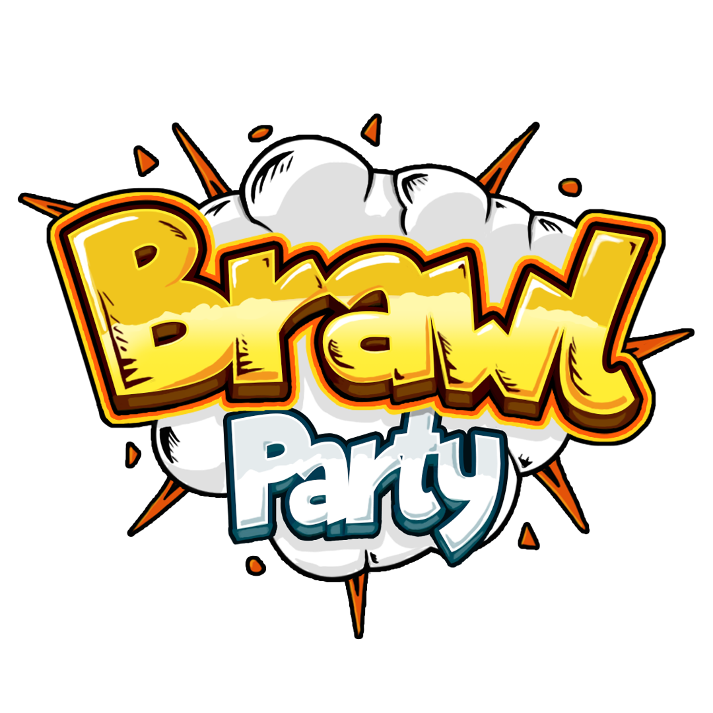

## Table of contents
* [General info](#general-info)
* [Screenshots](#screenshots)
* [Technologies](#technologies)
* [Setup](#setup)
* [Features](#features)
* [Status](#status)
* [Inspiration](#inspiration)
* [Contact](#contact)

## General info
Add more general information about project. What the purpose of the project is? Motivation?

## Screenshots

## Technologies
* Unity Engine - version 2019.3
* Blender - version 2.8
* Visual Studio - version 2019

## Setup
Describe how to install / setup your local environement / add link to demo version.

## Features
List of features ready and TODOs for future development
* Awesome feature 1
* Awesome feature 2
* Awesome feature 3

To-do list:
* Wow improvement to be done 1
* Wow improvement to be done 2

## Status
Project is: _in progress;

## Inspiration
Add here credits. Project inspired by..., based on...

## Contact

Created by [Only Lemons](https://www.facebook.com/onlemons/) - feel free to contact us!
